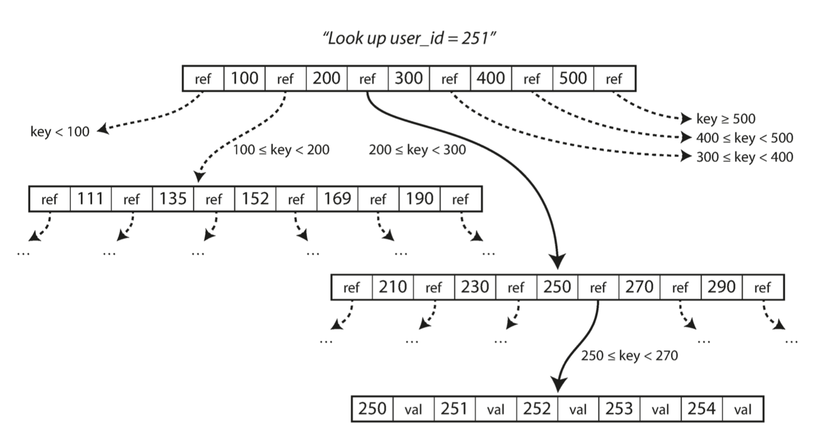

# 3. Storage and Retrieval
On the most fundamental level, a database needs to do two things: when you give it some data, it should store the data, and when you ask it again later, it should give the data back to you. From the database’s point of view: how we can store the data that we’re given, and how we can find it again when we’re asked for it. In order to tune a storage engine to perform well on your kind of workload, you need to have a rough idea of what the storage engine is doing under the hood. In particular, there is a big difference between storage engines that are optimized for transactional workloads and those that are optimized for analytics.

Many databases internally use a log, which is an append-only data file. An index is an additional structure that is derived from the primary data. Many databases allow you to add and remove indexes, and this doesn’t affect the contents of the database; it only affects the performance of queries. Maintaining additional structures incurs overhead, especially on writes, because the index also needs to be updated every time data is written.

This is an important trade-off in storage systems: well-chosen indexes speed up read queries, but every index slows down writes. For this reason, databases don’t usually index everything by default, but require you—the application developer or database administrator—to choose indexes manually, using your knowledge of the application’s typical query patterns. You can then choose the indexes that give your application the greatest benefit, without introducing more overhead than necessary.

## Hash Indexes
Bitcask offers high-performance reads and writes, subject to the requirement that all the keys fit in the available RAM, since the hash map is kept completely in memory. A storage engine like Bitcask is well suited to situations where the value for each key is updated frequently. For example, the key might be the URL of a cat video, and the value might be the number of times it has been played (incremented every time someone hits the play button). In this kind of workload, there are a lot of writes, but there are not too many distinct keys—you have a large number of writes per key, but it’s feasible to keep all keys in memory. Hash table does make range queries less efficient. 

If we only ever append to a file — how do we avoid running out of disk space? A good solution is to break the log into segments of a certain size. We can then perform compaction on these segments. Compaction means throwing away duplicate keys in the log, and keeping only the most recent update for each key. we can also merge several segments together at the same time as performing the compaction. The merging and compaction of frozen segments can be done in a background thread, and while it is going on, we can still continue to serve read and write requests as normal, using the old segment files.

CSV is not the best format for a log. It’s faster and simpler to use a binary format that first encodes the length of a string in bytes, followed by the raw string (without need for escaping).

## SSTables and LSM-Trees
Now, if we require the sequence of key-value pairs to be sorted by key, then we obtain Sorted String Table (SSTable). Its advantages over log segments with hash indexes is: 
- merging sorted segments is simple and efficient
- In order to find a particular key in the file, you no longer need to keep an index of all the keys in memory, you only need a subset of them in memory (one key for every few kbs of offset file).
- Allows for grouping and compression of blocks

Maintaining a sorted structure on disk is possible with B-Trees, and maintaining it in memory is easy with tree data structures such as red-black trees or AVL trees. With these data structures, you can insert keys in any order and read them back in sorted order.

We can now make our storage engine work as follows:
- For a new write, add it to an in-memory balanced tree data structure, aka, a memtable (e.g. red-black tree).
- When the memtable gets bigger than some MBs, write it out to disk as an SSTable file - it becomes the most recent segment of the database. While the SSTable is being written out to disk, writes can continue to a new memtable.
- In order to serve a read request, first try to find the key in the memtable, then in the most recent on-disk segment, then in the next-older segment, etc.
- From time to time, run a merging and compaction process in the background to combine segment files and to discard overwritten or deleted values.
- If the database crashes, the most recent writes in the memtable are lost. To avoid this, keep a separate append only log on disk, whose only purpose is to restore the memtable after a crash. Every time the memtable is written out to an SSTable, the corresponding log can be discarded.

This indexing structure was first described as Log-Structured Merge-Tree (LSM-Tree). 

Examples: LevelDB, RocksDB, Cassandra, HBase, Lucene, Elasticsearch, Solr, ...

## B-Trees (Self-balancing search tree)
It is the most widely used indexing structure. They remain the standard index implementation in almost all relational databases, and many nonrelational databases use them too.

B-trees break the database down into fixed-size blocks or pages, traditionally 4 KB in size, and read or write one page at a time. Each page can be identified using an address, which allows one page to refer to another (similar to a pointer, but on disk instead of in memory).

One page is designated as the root of the B-tree; it is where you start for each lookups. The page contains keys and their references to child pages. Each child is responsible for a continuous range of keys:

The number of references to child pages in one page of the B-tree is called the `branching factor`. In practice, typically it is several hundred. 

